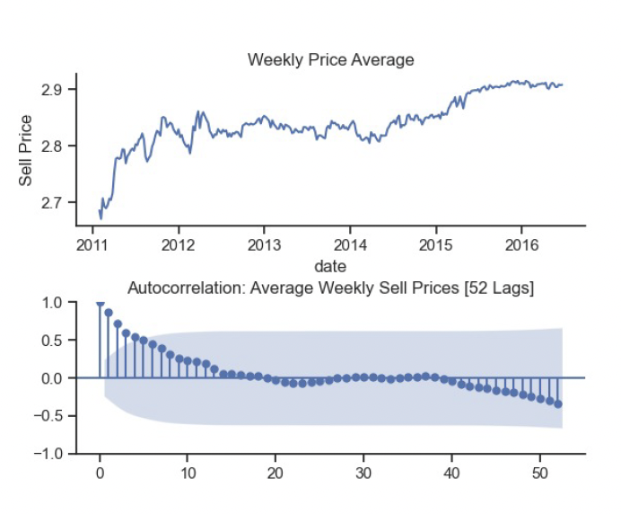
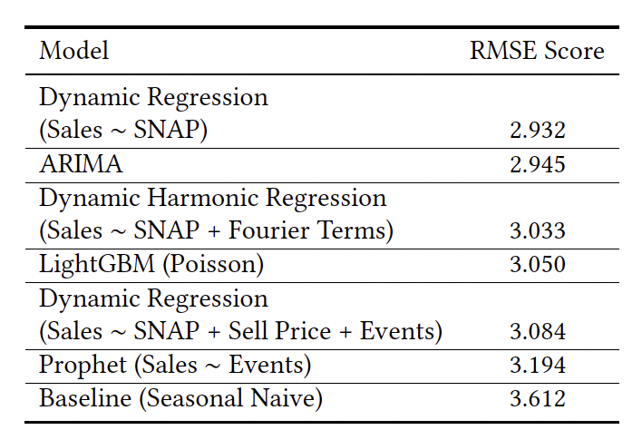

# Forecasting Sales for 823 food retail products for Walmart's TX3 store (M5 Forecasting)
#### Final project, *Applied Forecasting in Complex Systems*, 2023, University of Amsterdam (UvA), Dr. Erman Acar

Authors: Kyra Dresen, Mladen Mladenov, Martin Arnold



## Table of contents

- [Repository structure](#repository-structure)
- [Problem statement](#problem-statement)
- [Data](#data)
- [Our approach](#our-approach)
- [Results](#results)


## Repository structure

- `./EDA` contains the Explanatory Data Analysis scripts
- `./data` contains the data
- `./forecasts` forecasts for different models
- `./statistical_approaches` scripts for "classical" statistical appraoches
- `./plots` plots used in our report
- `./lightGBM` scripts used for the LightGBM model

Scripts are either Jupyter Notebooks or R scripts.

## Problem statement (from the assignement description)

Forecasting predicts the number of sales in the future. Having the right amount of products in stock is a core 
challenge in retail. A good forecast makes sure there are enough of your favourite products in stock, even if you come 
to the store late in the evening.

In this project, you will use a subset of M5 Forecasting - Accuracy hierarchical sales data from Walmart at one store, 
TX3 in the State of Texas, the world’s largest company by revenue, to forecast daily sales for the next 28 days. The 
data include item level, department, product categories, and store details. In addition, it has explanatory variables 
such as price, promotions, day of the week, and special events. Altogether, it can be used to improve forecasting 
accuracy.

## Data

The subset of M5 dataset, generously made available by Walmart, involves the unit sales of various products sold in 
the USA, more specifically, the dataset involves the unit sales of 3,049 products, classified into 3 product categories 
(Hobbies, Foods, and Household) and 7 product departments, in which the above-mentioned categories are disaggregated.

For this project, the selected products, Food3, are sold by TX3 store, located in Texas.

The dataset consists of the following five (5) files:

- `calendar_afcs2023.csv` contains information about the dates the products are sold
- `sell_prices_afcs2023.csv` contains information about the price of the products sold per store and date
- `sales_train_validation_afcs2023.csv` contains the historical daily unit sales data per product and store
- `sales_test_validation_afcs2023.csv`  contains the historical daily unit sales data per product and store
- `sales_test_validation_afcs2023.csv` contains the historical daily unit sales data per product and store

## Our approach
We identified three main characteristics to be taken into account for this challenge:

- **Complex seasonality:** We are dealing with daily data  which typically shows multiple seasonal patterns. In  our case, we discussed a yearly pattern and a weekly  pattern on an aggregate level. However, on the product  level these patterns are less clear and there might  be other seasonal patterns present depending on the
product type. Seasonal patterns from holidays are also changing, because some holidays not always fall on the same date (e.g. Easter).
- **Exogenous variables:** We expect exogenous variables to have a strong effect. As discussed, this includes price, holidays, or SNAP, or lagged values of these.  We need to have a model that can account for these variables.
- **Bottom level predictions:** Because we are doing forecasts on a bottom level (product level), we have to estimate 823 different models of each model type. It is  simply not feasible to manually select model parameters  for each product time-series but we will have  to rely on the automatic parameter selection of the  fable package.

Our approach consisted in comparing different models against each other, more specifically, "classical" statistical 
approaches:

- Baseline: a seasonal naive model,
- Dynamic Regression models,
- ARIMA,
- Meta's Prophet model,

to a more recent, machine-learning based approach:

- LightGBM (tree-based model)

While classical approaches work on time series data, feature engineering was a crucial part for LightGBM.

## Results

**Metric: RSME**
```math
\begin{equation}
RMSE = \sqrt{\frac{1}{n} \sum_{i=1}^n(y_i - \hat y_i)^2}
\end{equation}
```


Calculating the average RMSE over all 823 different products for the 28 days, we derived:




